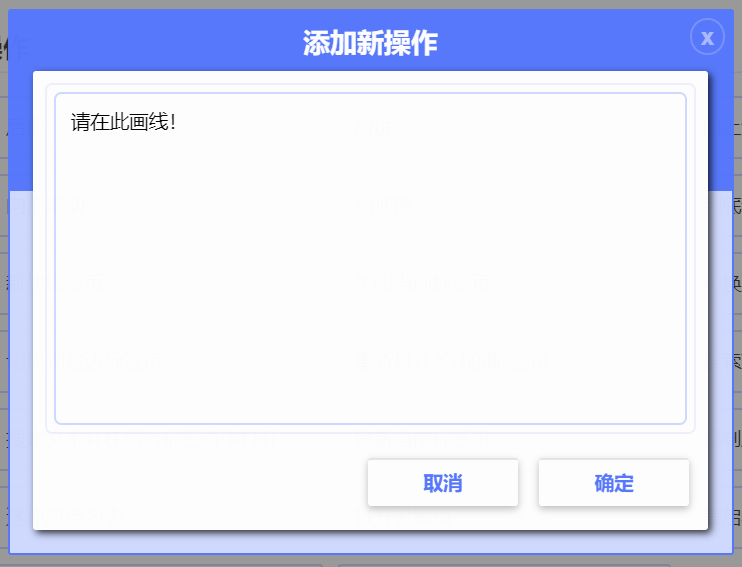
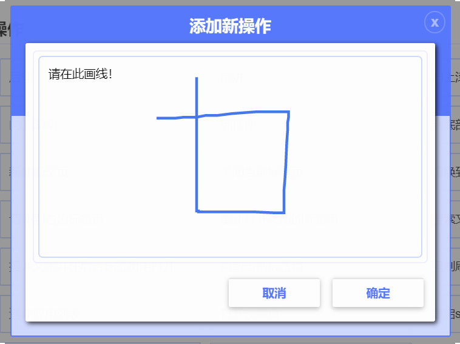

# 添加新手势

打开扩展的设置页，并依次展开左侧菜单：鼠标手势》操作。
请留意页面的右下角有个“+”按钮：  
  
点击该按钮即可开始添加手势的流程，根据该流程就可以完成一个新手势的添加：  
  
画出所需要的图案：  
  

!!! Note "注意："
	字母DRUL，分别对应的是四个方向的箭头，即：D-下(DOWN)、R-右(RIGHT)、U-上(UP)、L-左(LEFT)。

点击“下一步”按钮后，选择所需操作，然后“保存”即完成一个新手势的添加。