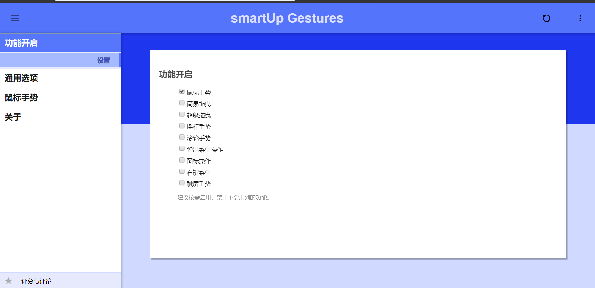
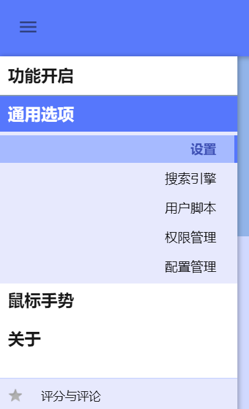
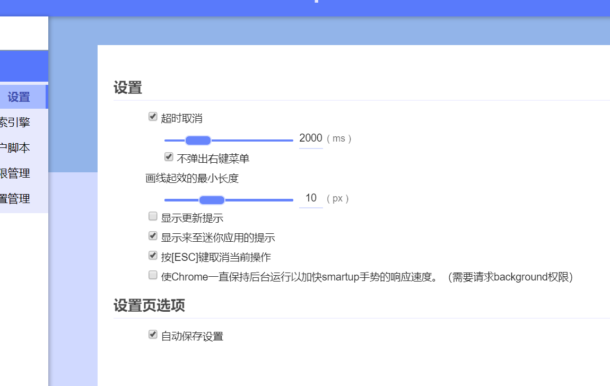
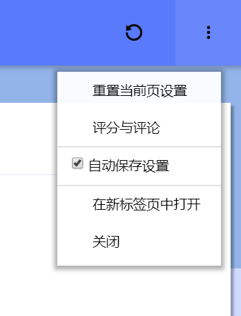
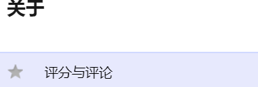

# 设置页概览

本页将介绍扩展设置页的组成部分。

smartup首次安装完成后，将打开扩展的设置页，关掉欢迎页后，设置页是这样的：  

左侧是菜单项。点击后展开下一级选项。  

右侧是当前菜单选项下的具体设置页面，不同的菜单选项会呈现不同的内容。  

右上角有针对当前页面的操作按钮，同时还有一个可供展开的菜单。  

左下角是给smartup评分及评论的链接，是chrome或者firefox官方商店地址。  
