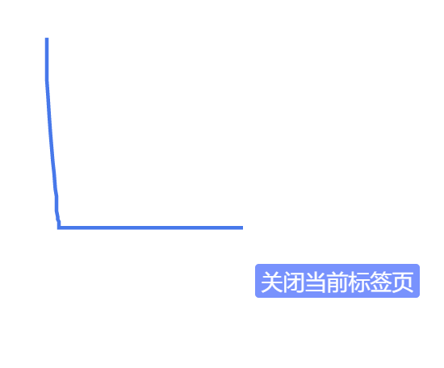
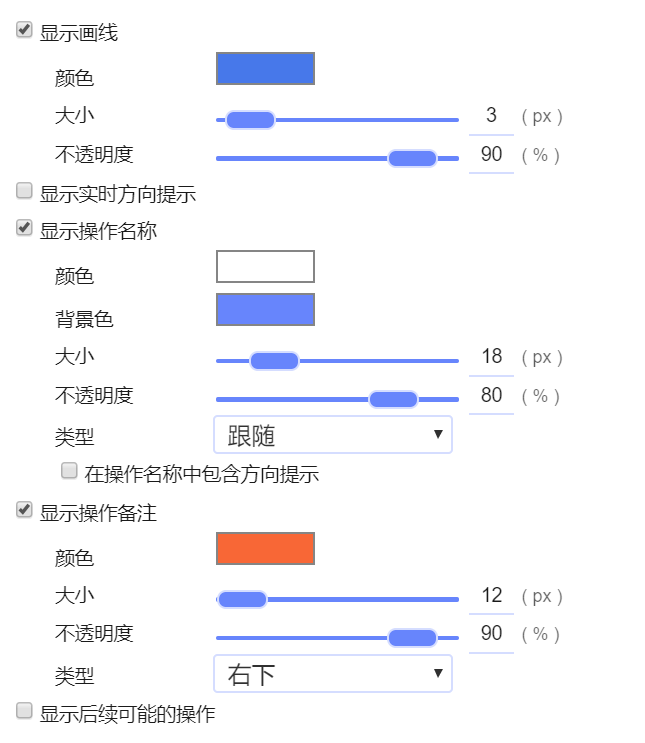
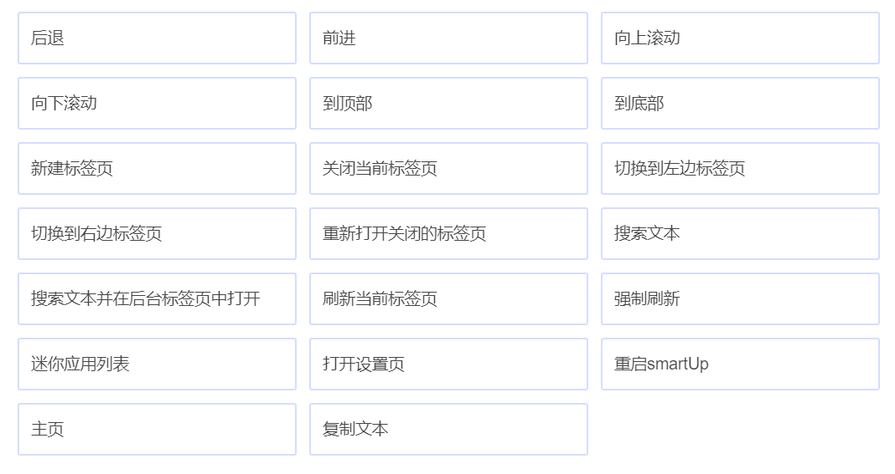
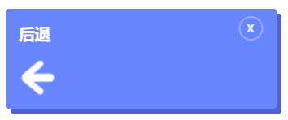
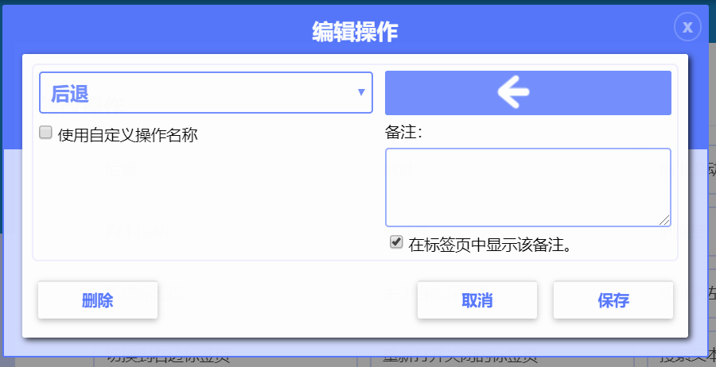
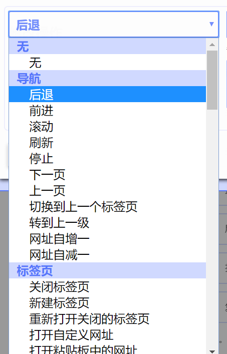
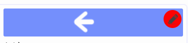
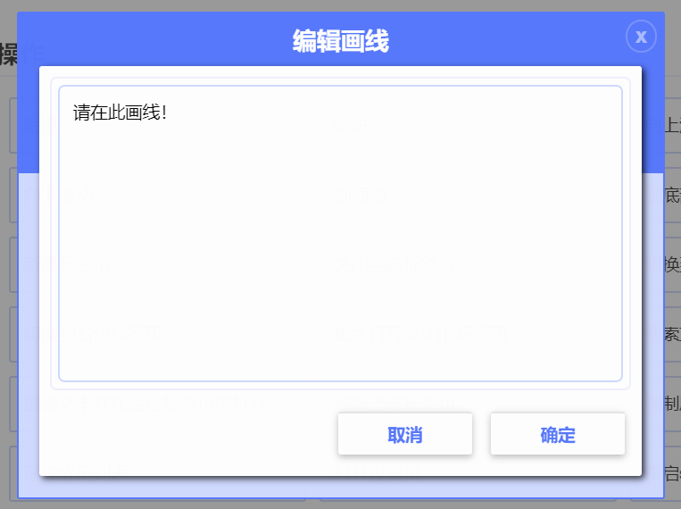

# 入门教程

## 第一个操作
打开一个网站，比如[bing.com](https://bing.com)。按住鼠标右键并保持，然后向下，再向右拖动鼠标，如下图所示：  
  
完成上面的步骤后，松开鼠标右键。前面打开的页面是不是已经关闭了呢?前面的操作就是一个简单的手势操作，实现了关闭当前页的功能。当然你可以画出不同的图形，来实现不同的操作。

## 设置
打开扩展的设置页，并依次展开左侧菜单：鼠标手势》设置。右侧页面中出现的是该菜单项下的一些选项。

| 选项|描述 |
| ------------ | ------------- |
|操作模式| 选择鼠标手势的触发方式：鼠标右键、中键|
|按住以下键来临时禁用鼠标手势| 当画出图形后，鼠标按键松开前，按下该选项设置的按键后，将取消当前的操作 |
|转换为网址，如果可以| 当鼠标手势的起始位置为选中的文本，且该文本是网址，那么该选项将尝试将目标转换为网址来查询相应的操作|
|视为图片，如果该链接包含有图片| 当鼠标手势的起始位置为链接，且该链接包含来图片，那么该选项将尝试将目标转换为图片来查询相应的操作|

## 外观
打开扩展的设置页，并依次展开左侧菜单：鼠标手势》外观。
该菜单项下，可以对画线、实时方向、操作名称、备注及后续的可能操作的颜色、大小和透明度等做个性化的设置。具体各项目会以什么样的外观呈现，请多做尝试比对。  

## 操作
打开扩展的设置页，并依次展开左侧菜单：鼠标手势》操作。
该菜单项下，可以增删、自定义手势。
打开后，呈现的是已经设置的所有手势操作的列表。  
  
鼠标移动到相应操作上后，将出现删除按钮，点击可以删除该手势操作。  
  
点击该项手势操作后，将展开该操作的详细设置。  
  
左侧下拉可以选择不同的操作：  
  
鼠标移动到右侧的箭头图案上面，会出现一个编辑的小图标。点击后将展开一个编辑画线的窗口。
  
在打开的窗口中，画出自定义的图案后，记得点保存。
  

!!! Note "注意："
	设置画线时，只有四个方向，即：上、下、左、右。